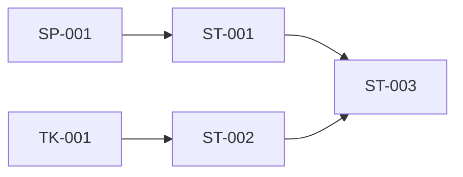

Translate functional and technical requirements into implementation-ready stories, research spikes, and infrastructure tasks. Produce a dependency graph and phase plan.

Load the spec-driven-dev skill and its reference files for templates and schemas.

## Steps

### 1. Locate the Spec

- If `$ARGUMENTS` is provided, look for `SPEC.md` at that path
- Otherwise, search the current directory with Glob (`**/SPEC.md`)
- If SPEC.md not found → tell user to start with `/spec-dev:create-spec`
- If no FR files → tell user to run `/spec-dev:derive-requirements` first
- If no TR files → tell user to run `/spec-dev:derive-technical` first

### 2. Read All Inputs

- Read SPEC.md (for context, constraints, personas)
- Read all FR files from `requirements/`
- Read all TR files from `technical/`
- Read `${CLAUDE_PLUGIN_ROOT}/skills/spec-driven-dev/references/frontmatter-schema.md` for work item schemas
- Read `${CLAUDE_PLUGIN_ROOT}/skills/spec-driven-dev/references/templates.md` for ST/SP/TK templates

### 3. Plan Work Items

Adopt the **technical-architect** perspective to derive work items. (Work inline — not a literal subagent spawn.)

#### Spikes First
- Identify requirements with significant technical unknowns
- Create SP-NNN spikes for each, assigned to phase "0"
- Each spike has a time-box and expected outputs

#### Tasks Next
- Identify infrastructure, configuration, or setup work
- Create TK-NNN tasks for each
- Map dependencies: tasks that stories will need

#### Stories Last
- Derive user-facing implementation increments from FR + TR combinations
- Create ST-NNN stories, each with:
  - User story format: "As a [role], I want [goal], so that [benefit]"
  - Acceptance criteria (testable checklist)
  - Solution approach
  - Point estimate (Fibonacci-ish: 1, 2, 3, 5, 8, 13)
  - Requirement traceability (`requirements` field)
  - Dependencies on other work items

#### Phase Assignment
- Phase 0: spikes
- Phase 1: core stories and critical tasks
- Phase 2+: extension stories, lower-priority items

### 4. QA Review

If the spec has `qa-adversary` in its personas list, adopt the **qa-adversary** perspective:
- Review all work items for missing edge-case stories
- Check for stories that modify the same resource without dependencies
- Verify acceptance criteria are testable
- Add `[QA]` annotations

### 5. Write Work Item Files

- Create `stories/`, `spikes/`, `tasks/` directories as needed
- Write each item to the appropriate directory with kebab-case slug filenames

### 6. Generate Dependency Graph

Create a Mermaid diagram showing the dependency relationships:



Use `<br>` for multi-line node labels (vault convention).

### 7. Present Summary

```
## Work Planned

**Spec**: {specName}

### Totals
| Type | Count | Points |
|------|-------|--------|
| Stories | N | N |
| Spikes | N | N |
| Tasks | N | N |
| **Total** | **N** | **N** |

### Points by Phase
| Phase | Items | Points |
|-------|-------|--------|
| 0 (Spikes) | N | N |
| 1 (Core) | N | N |
| 2 (Extension) | N | N |

### Critical Path
{List the longest dependency chain}

### Dependency Graph
{Mermaid diagram}

### Annotations
- {list any [QA] annotations}

**Next step**: Run `/spec-dev:refine {path}` to simulate implementation and sharpen work items, then `/spec-dev:review {path}` for formal consistency review.
```
